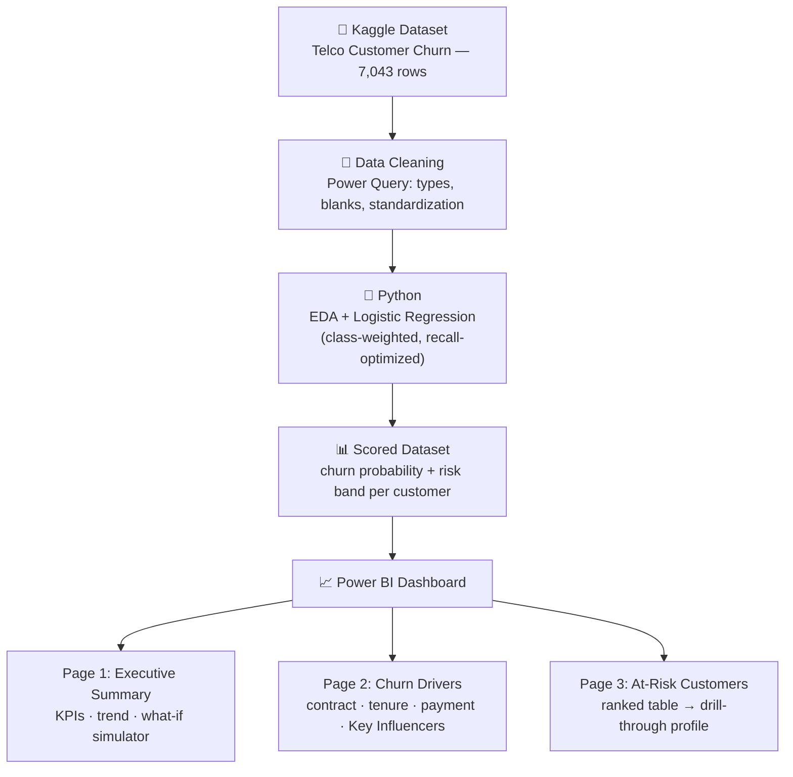

# ChurnLens — Telecom Churn & Revenue Risk Dashboard

End-to-end churn analytics: SQL/Power Query cleaning → Python logistic
regression → interactive Power BI dashboard.

## Problem

Telecom retention teams react after customers cancel. Retaining a customer
is 5–7x cheaper than acquiring one — the business needs to know who will
churn, why, and what it costs, before it happens.

## System Architecture

## Key Results

- **~$88K/month revenue at risk** identified across flagged customers
- Logistic regression: **80% recall, ROC-AUC 0.846** — outperformed
  Random Forest (0.831) while staying fully interpretable
- Top-15% risk flag captures the large majority of actual churners
- Top churn drivers: month-to-month contract (43% churn, 6.3x likelihood),
  electronic check payment (45%), first-year tenure (47%), fiber optic internet

## Dashboard

| Page | Purpose |
|---|---|
| Executive Summary | Churn %, revenue at risk, trend, retention-offer what-if simulator |
| Churn Drivers | Churn by contract/tenure/payment/charges + Key Influencers (AI visual) |
| At-Risk Customers | Ranked table with churn probability, drill-through to customer profile |

## Techniques

- DAX: dynamic segmentation (disconnected table), what-if parameter,
  probability-weighted expected revenue loss
- Python: class-weighted logistic regression for the 26.5% class imbalance,
  recall-optimized threshold
- Custom Figma-designed dashboard background

## Data

[Telco Customer Churn — Kaggle](https://www.kaggle.com/datasets/blastchar/telco-customer-churn)

## About Me

Hi, I'm *Vaishali Kawadapure** — an aspiring **Data Analyst** (fresher)
passionate about turning raw data into business decisions. This project
reflects my hands-on skills across the full analytics stack: **SQL,
Python, Power BI, and DAX**.

**I'm actively seeking Data Analyst / Business Analyst opportunities**
where I can bring this end-to-end problem-solving approach to real
business data.

**Let's connect:**
- LinkedIn: [www.linkedin.com/in/vaishali-kawadapure-26b629258]

*Open to feedback on this project — feel free to raise an issue or reach out!*
